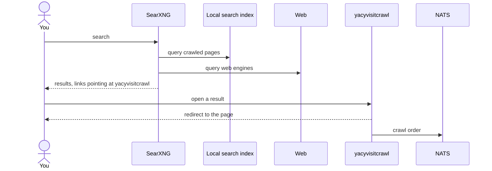
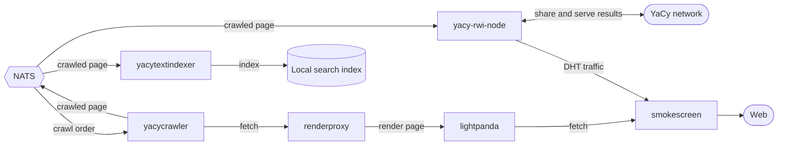

# Full YaCy stack

Runs all project services together. A node participates in the YaCy DHT network as a peer
while a self-hosted search engine serves queries locally. Search results combine crawled
pages with live web results. Opening a result triggers a crawl of that page, adding it to
the local corpus.

## Search-to-crawl flow

Result links point at yacyvisitcrawl. Opening a result redirects to the page and enqueues
a crawl order.

## Crawl pipeline

After a crawl order reaches NATS, the page is fetched and rendered, indexed into the local
search index, and shared onto the YaCy network.

## Setup

1. Copy `.env.example` to `.env` and set `YACY_PEER_HASH`, `YACY_PEER_NAME`,
   `YACY_ADVERTISE_HOST`, and `YACYVISITCRAWL_PUBLIC_URL`.
2. Copy the SearXNG settings for the chosen engine (see below) to `searxng/settings.yml`
   and set `server.secret_key`.
3. Copy `docker-compose.yml.example` to `docker-compose.yml`.
4. Start the stack: `docker compose up -d`.

## Monitoring

Prometheus scrapes every service. Grafana presents the crawl-to-serve pipeline at
`http://localhost:3000` and requires no login.

## Choosing a search-index engine

The stack stores and serves crawled pages from either Elasticsearch (default) or Manticore.
To switch, make the choice in three places, all set to the same engine:

| Engine | `.env` | `docker-compose.yml` include | `searxng/settings.yml` source |
| --- | --- | --- | --- |
| Elasticsearch | `SEARCH_INDEX_ENGINE=elasticsearch` | `compose/search-elasticsearch.yml` | `searxng/settings.yml.elasticsearch.example` |
| Manticore | `SEARCH_INDEX_ENGINE=manticore` | `compose/search-manticore.yml` | `searxng/settings.yml.manticore.example` |

In `docker-compose.yml`, keep exactly one of the two `search-*.yml` include lines uncommented.

See each Go service's `doc/configuration.md` for its environment variables, and
`plugins/searxng/searxng-crawled-text-search/doc/` and `plugins/searxng/searxng-result-router/doc/` for the SearXNG engine
and plugin the search UI runs.
